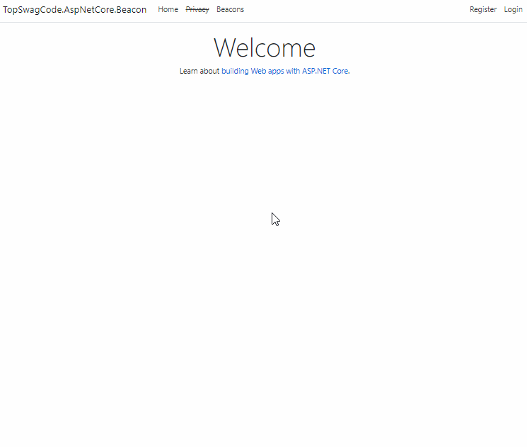

# TopSwagCode.AspNetCore.Beacon

This is a small sample project showing how to use Beacons with AspNetCore built on top of default WebAPI template using Individual authentication.

# What is it?

Mozillia describes it as: 
>The Beacon interface schedules an asynchronous and non-blocking >request to a web server.
>
>Beacon requests use HTTP POST and do not require a response.
>Beacon requests are guaranteed to be initiated before the page >unloads.
>See Beacon API for an overview [here.](https://developer.mozilla.org/>en-US/docs/Web/API/Beacon_API)

Simply said a smart way for sending small chunks of data to your server, in a way that does not slow down user and is guaranteed to send even when the user closes the browser or goes to other websites. 

# What can I use it for?

I won't write a lengthy blog post about it. Plenty of people have already done that. You can read a fine blog post for it [here.](https://www.smashingmagazine.com/2018/07/logging-activity-web-beacon-api/)

TLDR:
* Tracking stats and analytics data
* Debugging and logging
* Whatever brilliant plans you might have for it :)

# Can I use it?

Yes! (Not in IE) :)

[https://caniuse.com/#feat=beacon](https://caniuse.com/#feat=beacon)

# Less talk more Gif



So I built this small sample AspNetCore 3.0 MVC site, showing each load / unload event. You could really log whatever you want like mouse over events, click events, mouse movement, etc.

You can be as creative as you like. I made some logic to update session data for a user if the user logs in during their use of the website.

There was some gotchas while creating this sample repository. This project uses Text/Plain post messages to receive the Beacon messages, because there is a bug that you can find [here.](https://bugs.chromium.org/p/chromium/issues/detail?id=490015 ) The bug is regarding CORS for other content types. So for now stick to Text/Plain and simply parse the json serversides afterwards.

It was pretty easy to implement after that bug was found.

Frontend:

``` javascript
    window.onload = window.onunload = function analytics(event) {
        var data = {
                    "state": event.type,
                    "location": location.href,
                    "sessionUid": getSessionUid(), // Homebrew
                    "userTime": moment().format('YYYY-MM-DD[T]HH:mm:ss.SSSZ')  // momentJS to get DateTimeOffset
                };

        if (!navigator.sendBeacon) return;

        navigator.sendBeacon(url, JSON.stringify(data));

    }
```

Backend:

``` csharp
    [HttpPost]
    public async Task Post()
    {
        using StreamReader reader = new StreamReader(Request.Body, Encoding.UTF8);
        var json = await reader.ReadToEndAsync();
        
        _logger.LogDebug(json);
        
        var beaconRequest = System.Text.Json.JsonSerializer.Deserialize<BeaconRequest>(json);

        string userId = string.Empty;
        
        if(User.Identity.IsAuthenticated)
        {
            userId = User.FindFirstValue(ClaimTypes.Name);
        }

        _analyticsService.InsertAnalytics(beaconRequest, userId);
    }
```

You can go as crazy as you want :) 

# Supported by:

[](https://www.jetbrains.com/?from=TopSwagCode)